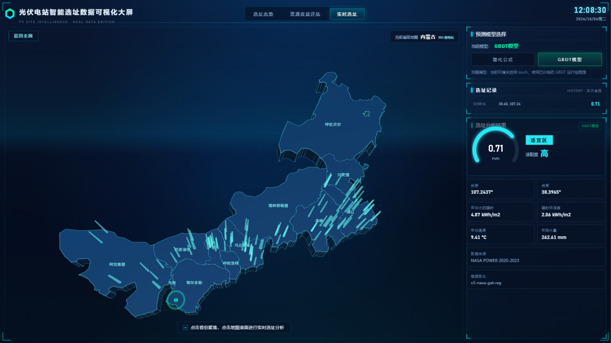

# 光伏电站智能选址可视化系统

基于 3D 地图与机器学习的光伏电站选址决策支持演示项目，提供全国电站分布可视化、资源/收益分析，以及基于气象数据的实时选址潜力预测。

> **开源声明**：本项目面向学习与科研交流开源，**仅供学习、研究与非商业演示**，不构成任何工程选址、投资或决策建议。完整许可见 [LICENSE](./LICENSE)。

## 演示

- 视频：[全国光伏电站智能选址可视化系统（Bilibili）](https://www.bilibili.com/video/BV1jojG66Eio/?share_source=copy_web&vd_source=f486789e701626cf145934c007761661)

<p align="center">
  
</p>
<p align="center">
  
  
</p>

## 功能概览

| 模块 | 路由 | 说明 |
|------|------|------|
| 选址态势 | `/#/dashboard` | Three.js 三维中国地图，省份按 PVPI 着色（左下色标），TOP 光柱 + 飞线 + 省级下钻 |
| 资源收益评估 | `/#/resource` | 联动散点主图：点击气泡 → 右侧省域详情卡 + 条形图高亮，TOP10 自动滚动榜 |
| 实时选址 | `/#/realtime` | 点击地图坐标：定位脉冲标记 + GBDT/GAT 预测 PVPI、等级仪表盘与会话选址记录 |

三个视图基于 Vue Router 独立成页（hash 模式，各有一址、刷新/深链接直达不 404），组件懒加载 + 按页分包。

技术要点：Vue 3 + Vue Router + Vite 前端大屏、Flask API、GBDT（可选 GAT）推理、NASA POWER 气候数据、ECharts 图表、ESLint 代码规范。

## 仓库结构

采用前后端分离的双工程根布局：

```text
.
├── LICENSE
├── README.md
├── docs/
│   └── screenshots/            # README 演示截图
├── frontend/                   # Vue 3 + Vue Router + Vite 可视化大屏
│   ├── src/
│   │   ├── api/                # 后端 API 客户端
│   │   ├── components/         # 地图、面板等通用组件
│   │   ├── composables/        # useFitScreen / useCharts
│   │   ├── router/             # 路由（三视图独立网址）
│   │   ├── stores/             # 共享状态（数据/实时预测，单例 composable）
│   │   ├── utils/              # 格式化、省份映射、PVPI 分级
│   │   ├── views/              # 三个页面级视图（懒加载）
│   │   ├── App.vue             # 大屏外壳（头部导航 + 路由出口）
│   │   └── main.js
│   ├── public/data/            # 前端演示用轻量静态数据
│   ├── scripts/sync-data.mjs
│   ├── eslint.config.js
│   └── package.json
└── backend/                    # Flask API 服务
    ├── main.py                 # 统一启动入口
    ├── pyproject.toml          # 推荐用 uv 管理依赖
    ├── requirements.txt
    ├── src/
    │   ├── api/                # HTTP 接口
    │   └── lib/                # 工具库与路径常量
    ├── data/                   # 本地数据（默认不入库，体积大）
    ├── models/                 # 模型权重（默认不入库）
    └── resource/               # 运行日志等（默认不入库）
```

> 地理原始数据、处理后的全量站点表、模型 `.pkl` 等大文件已写入 `.gitignore`，需自行准备到 `backend/data/`、`backend/models/`。

## 技术栈

**前端**：Vue 3、Vue Router 4、Vite、Three.js、ECharts、D3（地理相关处理）、ESLint（flat config）

**后端**：Python 3.10+、Flask、NumPy / Pandas / SciPy / scikit-learn、LightGBM / XGBoost；可选 PyTorch + PyTorch Geometric（GAT）

**指标**：PVPI（光伏潜力指数）、GHI 等气象与空间特征

## 环境要求

- Python **3.10+**（推荐使用 [uv](https://github.com/astral-sh/uv)）
- Node.js 18+（或 16+）与 npm
- 实时选址的完整模型模式需要可访问 [NASA POWER](https://power.larc.nasa.gov/) 的网络

## 快速开始

### 1. 准备本地数据与模型（按需）

仓库默认不含大体积数据。本地需具备例如：

| 路径 | 说明 |
|------|------|
| `backend/models/model_gbdt_runtime.pkl` | 无 torch 时的 GBDT 运行包（推荐） |
| `backend/models/model_gat_gbdt_pvssi.pkl` | 完整 GAT+GBDT 包（可选，需 torch） |
| `backend/data/solar/pv_stations_mcdm_scored.csv` | 站点评分表，供前端 `sync:data` 同步 |

若仅有完整 pickle、缺少运行包，可在已安装 torch 的环境执行：

```bash
cd backend
python training/scripts/export_gbdt_runtime.py
```

### 2. 启动后端

```bash
cd backend
uv sync
uv run python main.py
```

默认监听 `http://127.0.0.1:5000`。

可选：

```bash
uv run python main.py --mode full|simple|base
# 需要 GAT 推理时（下载较大）：
uv sync --group torch
```

也可用 pip：

```bash
cd backend
pip install -r requirements.txt
python main.py
```

也可使用 conda（本项目开发环境为 Python 3.11 的 `cpvp` 环境，含 torch；仅 GBDT 推理无需 torch）：

```bash
conda create -n pv python=3.11 -y
conda activate pv
cd backend
pip install -r requirements.txt
python main.py
```

#### 运行时环境变量

| 变量 | 默认值 | 说明 |
|------|--------|------|
| `PV_RATE_LIMIT_PER_MIN` | `60` | `/api/predict` 每 IP 限流（次/分钟），`<=0` 关闭 |
| `PV_NASA_CACHE_TTL` | `86400` | NASA POWER 结果缓存时长（秒）。数据按 0.5° 网格单元缓存，历史数据不变可长期缓存 |
| `PV_ENABLE_DEBUG_ENDPOINTS` | 关闭 | 设为 `1` 时启用 `/api/debug_model` 调试端点（默认 404） |
| `--debug`（命令行） | 关闭 | Flask 调试模式，仅限本地开发，勿对外网开放 |

冒烟测试（不依赖外网 NASA，使用 mock）：

```bash
cd backend
uv run python training/scripts/smoke_api.py
```

覆盖项：模型加载（GBDT 运行包优先）、参数校验、气候数据有效性、NASA 网格缓存、限流 429、离线回退、调试端点门控与信息泄露检查。全部通过时输出 `ALL CHECKS PASSED`。

### 3. 启动前端

```bash
cd frontend
npm install
npm run sync:data   # 从 backend/data/solar 同步站点统计（若本地有数据）
npm run dev
npm run lint        # ESLint 检查（lint:fix 自动修复）
```

开发服务默认：`http://127.0.0.1:5173`（已将 `/api` 代理到后端 `5000` 端口；端口被占用时 Vite 会自动换下一个，注意以终端实际输出为准）。

`npm run dev` / `npm run build` 前会自动执行 `sync:data`：本地缺少 `backend/data/solar/pv_stations_mcdm_scored.csv` 时仅跳过同步并提示，不会中断启动（全新克隆可直接跑通演示，页面会提示数据未加载）。

生产构建：

```bash
npm run build
npm run preview
```

## 数据与模型说明

### 核心指标

- **PVPI**：光伏潜力综合评分（演示用指数）
- **GHI**：水平面总辐照等相关气象量
- **面积 / 电站数量**：省级或站点统计展示

### 前端静态数据

位于 `frontend/public/data/`：

- `china_full.json`：中国地理边界（演示用）
- `provincial_statistics.csv`：省级统计
- `pv_stations_mcdm_scored.csv`：可由 `npm run sync:data` 从后端数据目录生成（全量表默认不强制入库）

### 推理说明

- 默认优先加载 **GBDT 运行包**（`model_gbdt_runtime.pkl`）：推理耗时毫秒级，且完全不导入 torch，启动更快
- 仅当运行包缺失时才回退加载 GAT 完整包，并按需惰性导入 torch（`uv sync --group torch`）
- 实时预测依赖 NASA POWER；NASA 不可用时，**简化公式**自动回退到最近真实站点气候数据，保证离线可用；完整模式会明确报错（HTTP 503），避免静默给出错误高分
- 后端完全不可达时，前端会用内置站点数据本地估算兜底，并在结果中标注「本地真实数据兜底」与回退原因
- NASA POWER 数据为 0.5° 网格且历史数据不变，后端按网格单元缓存响应（默认 24h），相邻点击命中同一网格时即时返回，同时避免因重复请求被 NASA 限制

### 安全与稳定性

- `/api/predict` 内置每 IP 滑动窗口限流（默认 60 次/分钟，可用环境变量调整）
- Flask 调试器默认关闭（`--debug` 显式开启，仅限本地）
- `/api/debug_model` 默认不注册，需 `PV_ENABLE_DEBUG_ENDPOINTS=1`
- 异常分级返回：参数错误 400、上游数据不可用 503、未预期错误仅返回通用信息并记录服务端日志，不泄露内部路径
- 前端对实时选址请求做了竞态保护：连续点击地图时旧请求结果自动丢弃

## 使用提示

1. 顶部标签切换「选址态势 / 资源收益 / 实时选址」，或直接访问对应网址（`/#/dashboard`、`/#/resource`、`/#/realtime`）  
2. 地图：滚轮缩放、拖拽平移；左键省份下钻，右键返回全国  
3. 实时选址：点击地图取点，等待后端返回 PVPI、等级与气象摘要；右侧可随时切换简化公式 / GBDT 模型，结果面板会标注数据来源与推理版本

## API 概览

| 端点 | 方法 | 说明 |
|------|------|------|
| `/api/predict?lat=&lon=&mode=simple\|full` | GET | 实时选址预测。`simple`=简化公式（NASA 不可用时回退最近真实站点），`full`=GBDT/GAT 模型（NASA 不可用时返回 503）；受每 IP 限流 |
| `/api/status` | GET | 模型加载状态、类型、特征列、等级映射 |
| `/api/toggle_mode` | POST | 切换简化/完整模型（`{"mode": "simple"\|"full"}`） |
| `/api/health` | GET | 存活探针 |
| `/api/debug_model` | GET | 调试端点，默认 404，需 `PV_ENABLE_DEBUG_ENDPOINTS=1` |

## 开发说明

| 路径 | 作用 |
|------|------|
| `backend/main.py` | 后端统一入口 |
| `backend/src/api/app_full.py` | 完整预测服务 |
| `backend/src/lib/paths.py` | 数据/模型路径常量 |
| `backend/training/scripts/calc_mcdm_pvpi.py` | PVPI 评分脚本（本地研究工具，不入库） |
| `frontend/src/App.vue` | 大屏外壳（头部导航 + 路由出口） |
| `frontend/src/router/index.js` | 路由定义（hash 模式，懒加载） |
| `frontend/src/stores/solarData.js` | 站点统计数据加载与派生指标 |
| `frontend/src/stores/realtime.js` | 实时预测请求/模型切换/历史记录 |
| `frontend/src/views/*.vue` | 三个页面级视图 |
| `frontend/src/components/ThreeChinaMap.vue` | 三维地图组件 |

欢迎通过 Issue / PR 讨论学习问题；请勿提交大体积数据、密钥或个人隐私信息。

## 生产部署建议

Werkzeug 开发服务器仅适合本地演示，对外提供服务时建议使用 WSGI 容器（以 waitress 为例）：

```bash
pip install waitress
cd backend
waitress-serve --host=0.0.0.0 --port=5000 main:app  # 需在 main.py 中导出 app 或使用如下方式
# python -c "from src.api.app_full import app; from waitress import serve; serve(app, host='0.0.0.0', port=5000)"
```

前端生产构建后由任意静态服务器托管 `frontend/dist/`，并将 `/api` 反向代理到后端 5000 端口（Nginx/Caddy 均可）。前端路由为 hash 模式，静态托管无需配置 history fallback。

## 参考与优化方向

项目方法论与成熟实践对照，可沿以下方向继续演进：

- **数据源**：NASA POWER（当前，0.5° 网格）可扩展 [PVGIS](https://joint-research-centre.ec.europa.eu/pvgis-online-application/getting-started/pvgis-data-download-csv_en)（欧盟 JRC，逐时数据）与 [Global Solar Atlas / Solargis PVOUT](https://energydata.info)（世界银行 ESMAP，含光伏出力栅格）做交叉校验
- **发电量建模**：引入 [pvlib-python](https://github.com/pvlib/pvlib-python) 做 PV 系统建模（温度修正、逆变器效率、逐时仿真），把 PVPI 从资源评分升级为发电量/LCOE 估计
- **选址方法论**：GIS + MCDM（AHP/熵权法/TOPSIS）是主流范式，可参考 Tahri et al. 2015、Cunden et al. 2020 等论文补充坡度坡向、土地利用、保护区、电网可达性等约束层
- **GNN 推理**：GAT 路径已支持惰性加载；进一步可做归纳式（inductive）推理子图缓存，避免每次请求重建全图

## 常见问题（Troubleshooting）

| 现象 | 原因与处理 |
|------|------------|
| 前端显示「真实数据加载失败」 | `frontend/public/data/` 缺少站点表或省级统计。按「准备本地数据与模型」准备好 `backend/data/solar/pv_stations_mcdm_scored.csv` 后重跑 `npm run sync:data`，或从后端数据目录手动复制 |
| 实时选址提示 NASA 不可用 | 简化模式会自动回退到最近真实站点数据（结果标注数据来源）；完整模式明确报 503。检查网络后点击「重试」即可 |
| 后端启动后只有简化公式 | `backend/models/` 缺少模型包。放入 `model_gbdt_runtime.pkl`（推荐）或 `model_gat_gbdt_pvssi.pkl`，重启后端；仅有完整包且需要 GAT 时执行 `uv sync --group torch` |
| 返回 429「请求过于频繁」 | 触发每 IP 限流（默认 60 次/分钟）。等待窗口重置，或用 `PV_RATE_LIMIT_PER_MIN` 调整/关闭 |
| 5000 端口被占用 | `python main.py --port 5001`，并将 `frontend/vite.config.js` 中代理目标同步改为新端口 |
| 完整模式 PVPI 恒为 1.00 或提示推理版本过旧 | 后端为旧版本进程，重启 backend 后刷新页面 |
| 首次预测很慢 | NASA POWER 首次请求需在线拉取，同 0.5° 网格后续点击会命中缓存即时返回 |

## 免责声明

- 本项目输出仅为算法与可视化**演示结果**，不能替代专业勘测、规划或合规评估。  
- 第三方数据（如 NASA POWER、公开地理边界等）请遵守其各自使用条款。  
- 作者不对依据本项目作出的任何决策承担责任。

## 作者

**LinJJ12**

## 许可证

见根目录 [LICENSE](./LICENSE)：仅供学习与研究，禁止商业使用（除非另行获得书面授权）。

---

学习交流，清洁能源。
